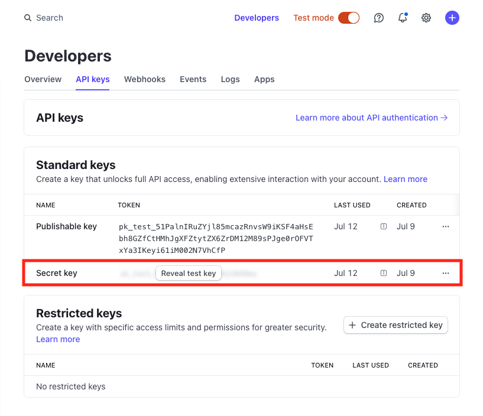

# `stripe-demo-app`
A basic web app for **Cozy Threads**, a fictional direct-to-consumer e-commerce brand that sells high-quality, ethically-sourced apparel and accessories.

## Why (purpose)
To showcase Stripe payments' capabilities

## What (requirements)
- **Product Catalog:** a list of Cozy Threads' products, including an image, title, description, and price for each item
- **Shopping Cart:** where customers can add products to a shopping cart and view the items they've selected
- **Checkout:** a checkout flow that uses Stripe to securely collect payment information and complete the transaction. Display the result to the customer.
- **Write-Up:** a less-than-700-word write-up that covers
  - the overall architecture and design of this application
  - key decisions made in the implementation, including any trade offs or areas that could be improved upon with more time
  - any additional features or functionality that could be added to the application given more time

## How (implementation)
- [x] version control: Git, GitHub
- [x] backend: Python, Stripe SDK's APIs
  - [x] Stripe Checkout: redirect customers to a Stripe-hosted payment page
- [x] frontend: HTML, CSS, React with TypeScript
- [x] CI/CD: GitHub Actions
  - [x] linting
  - [x] testing: pytest
- [x] containerization: Docker
- [ ] deployment: AWS Cloud Development Kit
- [ ] monitoring: Datadog

## Running the web app locally

1. Clone this repo on your local machine:
   ```
   $ git clone git@github.com:shilongjaycui/stripe-demo-app.git
   ```
2. Navigate into the web app's server:
   ```
   $ cd stripe-demo-app/backend
   ```
3. Create a Python virtual environment:
   ```
   $ python -m venv venv
   ```
4. Activate the virtual environment:
   ```
   $ source venv/bin/activate
   ```
5. Build the server:
   ```
   $ make build-server
   ```
6. Create a Stripe account [here](https://dashboard.stripe.com/login).
7. (Recommended) Turn your Stripe account to test mode.
8. Create and copy a Stripe API secret key [here](https://dashboard.stripe.com/test/apikeys):
   
9.  Add the Stripe API secret key to your terminal session as an environment variable:
    ```
    $ export STRIPE_API_KEY=<your-stripe-api-secret-key>
    ```
10. (Optional) Make the `STRIPE_API_KEY` environment variable available for all future terminal sessions by saving it to your `.zshrc` file:
    ```
    $ echo '' >> ~/.zshrc && echo 'export STRIPE_API_KEY=<your-stripe-api-secret-key>' >> ~/.zshrc
    $ source ~/.zshrc
    ```
11. Run the server:
    ```
    $ make run-server-locally
    ```
12. In a separate terminal session, navigate into the web app's client:
    ```
    $ cd stripe-demo-app/frontend
    ```
13. Build the client app:
    ```
    $ make build-client
    ```
14. Run the client app:
    ```
    $ make run-client-locally
    ```
15. Go to [http://localhost:3000/checkout](http://localhost:3000/checkout)
16. To simulate a payment, please put down the following credit card number: `4242 4242 4242 4242`

## Running the web app in Docker containers

1. Clone this repo on your local machine:
   ```
   $ git clone git@github.com:shilongjaycui/stripe-demo-app.git
   ```
2. Navigate into the repo:
   ```
   $ cd stripe-demo-app
   ```
3. Create and save a Stripe API key by following steps 6 through 10 [above](#running-the-web-app-locally).
4. Build and spin up both the backend container and the frontend container:
   ```
   $ docker-compose up --build
   ```
5. Go to [http://localhost:3000/checkout](http://localhost:3000/checkout)
6. To simulate a payment, please put down the following credit card number: `4242 4242 4242 4242`
7. Tear down the containers after use:
   ```
   $ docker-compose down
   ```
